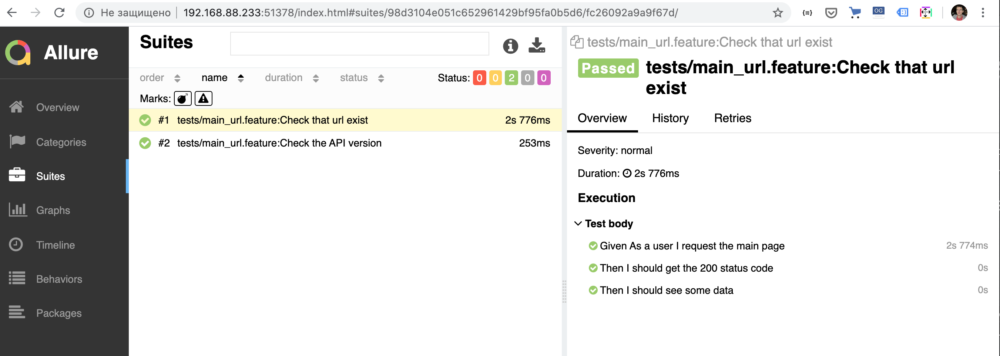
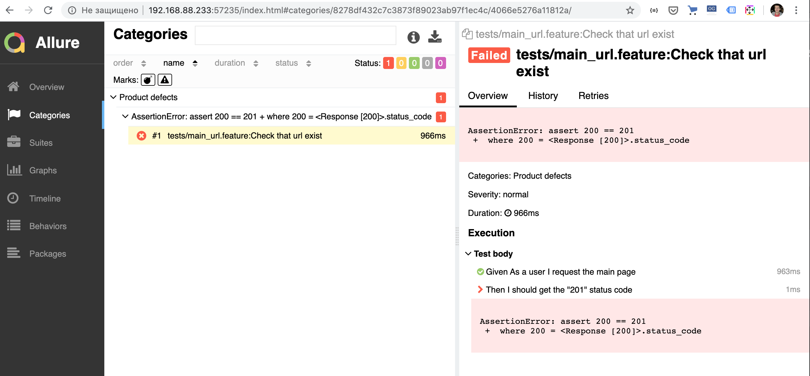

# Test API for JPL
https://ssd-api.jpl.nasa.gov/cad.api

This is the example of Test automation suite for API provided for  
JPL’s SBDB (Small-Body DataBase)
https://ssd-api.jpl.nasa.gov/doc/cad.html

For the Test automation project we use:
- Python as the project language, 
- PyTest as a test runner,
- pytest-bdd runner as the bdd framework for writing tests (it was chosen because 
it allows to use all PyTest runner features,
- Allure Test Report for visual reports http://allure.qatools.ru/
- Docker software for containerization software for test runs

# Demo report
There couple of tests in this repo. You can just run all tests and
see the results executing only two commands in your commandline. 
You don't need any software installation locally because tests
will be run in docker containers. Be sure that you have docker software installed on your laptop

1. Move to root of the current repository
2. Run tests with Makefile

`make build-and-run-tests`

3. Run the Allure server in docker container

`make serve-report`

4. Interactive reports will be accessible on the url http://localhost:4040/index.html.
Now we can see that API works as expect:



If one of the test will become broken you will see which specific step in the scenario led to the error:



## Run tests in the docker containers

Build docker image with tests and all requirements:

`make docker-build`

Run tests in container:

`make run-tests`

Build and run tests with one command:

`make build-and-run-tests`

We use Allure framework for generating and serving html reports.
Reports are handling in docker container, thanks to https://github.com/fescobar/allure-docker-service.
Run Allure server to get pretty report. Next command run the allure-docker-service detached. It can be 
stopped manually when we will not need this service more:

`make serve-report`

Report will be accessible in your browser on http://localhost:4040/index.html

Just change or add tests and run tests in the container again:

`make build-and-run-tests`

You will see new tests results on http://localhost:4040/index.html

## Developing tests and run tests locally
When we are writing and debugging tests it is easier to 
run all services on your laptop or PC.

### BDD approach
Business analysts, product managers or people from the business side can write tests in natural language.
The example work flow for analyst and QA engineer:
1. Analyst clone the repo https://github.com/alekspog/jpl_api_example/ to their laptop.
2. Analyst creates new {feature_name}.feature file in the /tests folder and 
describe new feature and its scenarios in the file. They should use the subset of Gherkin language
with "given, when, then" syntax. Check the https://cucumber.io/docs/gherkin/reference/.
They also can use example scenarios from our repo https://github.com/alekspog/jpl_api_example/blob/master/tests/main_url.feature
3. Now QA specialist is in the game. Firstly QA engineer can generate test code sample 
from feature file using the command line:
`pytest-bdd generate ./{feature_name}.feature > tests/test_{feature_name}.py`
4. Then QA implement the test functions for new scenarios using documentation 
from https://github.com/pytest-dev/pytest-bdd
5. QA checks the implemented tests running 

`pytest -v --gherkin-terminal-reporter`

### Instructions for QA engineers
1. Clone the repo `git clone https://github.com/alekspog/jpl_api_example.git`
2. Be sure you have python3.* installed on your laptop.
Create python virtual environment `python3 -m venv ./my_env`
Activate the environment `source venv/bin/activate`
3. Install project requirements 
```
cd tests
python -m pip install -r requirements.txt
```
4. Write tests in pytest-bdd style
5. Run tests with gherkin terminal reporter
`pytest -v --gherkin-terminal-reporter`

## Local visual reports
We use Allure framework to get visual reports. You will need install allure-cli to use this feature.

### Install allure
#### Linux
For debian-based repositories a PPA is provided:
```
sudo apt-add-repository ppa:qameta/allure
sudo apt-get update 
sudo apt-get install allure
```

#### macOS
`brew install allure`

## Run tests with pytest and pass alluredir argument to save report results
```
rm -rf /tmp/allure_results
pytest -v --gherkin-terminal-reporter --alluredir=/tmp/allure_results
```

### Serve tests results in the browser
`allure serve /tmp/allure_results`

The report will open in the browser automatically.
If you change the project files run tests and report server again:

```
rm -rf /tmp/allure_results
pytest -v --gherkin-terminal-reporter --alluredir=/tmp/allure_results
allure serve /tmp/allure_results
```

You can also use shortcuts to run tests and get the fresh report:
```
make run-tests-locally
make serve-report-locally
```


